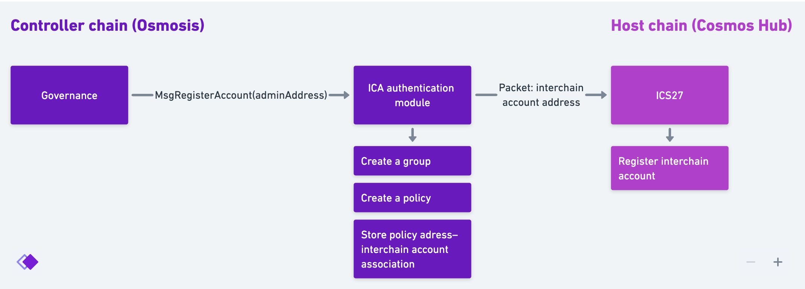

# Messages

## ICA authentication module (on a controller chain)

### Register an interchain account

```protobuf
message MsgRegisterAccount {
  repeated MemberRequest members = 1;
	cosmos.base.v1beta1.Coin amount = 2; // to send to the policy address
}
```

The information about chains in CNS can be updated by interchain accounts. Before any data about a controller chain can be written to CNS, an interchain account has to be created. An interchain account can only be created as a result of a governance vote on the controller chain.

[](https://whimsical.com/VFCP16ja6B7kvkTSXhGW89)

Authority: controller’s governance.

Fail conditions:

- The message doesn’t originate from a governance proposal.
- The community pool doesn’t have the `msg.amount` tokens.

State modifications:

- Creates a new group with `CreateGroupWithPolicy` with given members
- Group's admin is set as a policy address
- Set the global `group` value to the group ID.
- Sends an IBC packet to the host chain to register a specific interchain account.
- Stores an association between a group policy address and a registered interchain account address.

### Verify network information

```protobuf
message MsgVerifyNetwork {
	string owner; // owner address (ICA or regular account)
	uint64 networkID;
	bool verified;
}
```

Authority: controller’s governance.

Fail conditions:

- On the controller chain:
    - The message doesn’t originate from a governance proposal.
- On the host chain:
    - A network with Network ID that matches `msg.networkID` doesn't exist

State modifications:

- On the host chain:
    - Get `Network` by `msg.networkID`. Set `verified` to `msg.verified`.
    - Set `verifiedDate` to the current block’s timestamp.

### Change group admin

> TODO: think of a better message name.

```protobuf
message MsgUpdateGroupMembers {
  repeated MemberRequest members = 1;
}
```

Fail conditions:

- `members` is empty

State modifications:

- Call group module's `UpdateGroupMembers` and update the members of the group (get group ID from the global value)

## Chain naming service module (on the host chain)

### Create chain

```protobuf
message MsgCreateChain {
	string owner; // owner address (ICA or regular account)
	uint64 networkID;
	ChainDetails details;
}
```

Authority: controller’s group.

Fail conditions:

- `msg.owner` doesn’t match the owner of the `Network` with `msg.networkID`
- A network with Network ID that matches `msg.networkID` doesn't exist

State modifications:

- Create a new chain entry.

### Update chain

```protobuf
message MsgUpdateChain {
	string owner; // owner address (ICA or regular account)
	uint64 chainID;
	ChainDetails details;
}
```

Fail conditions:

- Get a network that the chain with `msg.chainID` belongs to. Fail if `msg.owner` doesn’t match the owner of the network.
- A chain with ID that matches `msg.chainID` doesn't exist.

State modifications:

- Update the chain with `msg.details`.

### Create network

```protobuf
message MsgCreateNetwork {
	string owner; // owner address (ICA or regular account)
	NetworkDetails details;
}
```

Fail conditions:

- N/A.

State modification:

- Create a new `Network`.
    - Set `id` as an incrementing integer
    - Set `owner` as `msg.owner`
    - Set `name` as an empty string
    - Set `verified` as `false`

### Update network

```protobuf
message MsgUpdateNetwork {
	string owner; // owner address (ICA or regular account)
	uint64 networkID;
	NetworkDetails details;
}
```

Fail conditions:

- `msg.owner` doesn’t match the owner of the `Network` with `msg.networkID`
- A network with Network ID that matches `msg.networkID` doesn't exist

State modifications:

- Set `NetworkDetails`

### Set host’s group


> ⚠️ Think of a better name

```protobuf
message MsgSetGroup {
	string address;
}
```

Authority: host’s governance

Fail conditions:

- N/A

State modifications:

- TODO!

### Assign network name

```protobuf
message MsgAssignNetworkName {
	string address; // Cosmos Hub group policy address
	uint64 networkID;
	string name;
}
```

Authority: host’s group.

Fail conditions:

- A network with Network ID that matches `msg.networkID` doesn't exist