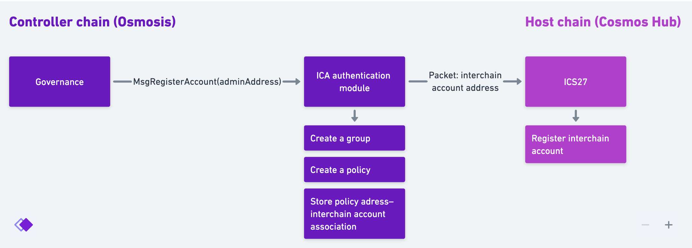

# Overview

The CNS system is implemented as two Cosmos SDK modules:

- On the controller chain: ICA authentication module (ICA AM). The purpose of ICA AM is to ensure that only governance can send certain messages (register an ICA account) and that only a particular group can send certain other messages (update CNS values).
- On the host chain: CNS module. The main purpose of the CNS module is to store the association between chain names and chain data of controller chains and to control which interchain account on the host chain is authorized to update the corresponding chain data.

Hight-level overview of the functionality:

1. On the controller chain:
    1. The governance selects group will be authorized to submit changes to CNS.
    2. The group’s admin chooses group members.
    3. Group members vote on proposals that contain messages (like `MsgCreateChain` and `MsgUpdateChain`) that will modify the state of CNS
    4. The governance verifies that the information in CNS is up-to-date and valid
2. On the host chain:
    1. CNS module stores the data about chain names.
    2. The governance chooses a group that will be authorized to associate chain info (provided by the controller chain) with a chain name and an IBC client.
    3. The group assigns chain names and IBC clients to chain info.

## The governance selects group will be authorized to submit changes to CNS

The governance proposal inclundes a `MsgRegisterAccount` message.

Creating a group makes the decision-making process more agile because every change doesn’t have to go through a slow-moving governance process.

The information about chains in CNS can be updated by interchain accounts. Before any data about a controller chain can be written to CNS, an interchain account has to be created. An interchain account can only be created as a result of a governance vote on the controller chain.

## Group members vote on proposals that contain messages that will modify the state of CNS

The messages are sent via the ICA authentication module over IBC to the host chain to be broadcasted by the chain’s ICA account to the CNS module.

Interacting with CNS is possible through:

- an interchain account. With an ICA a controller chain’s governance owns the record in CNS. This, however, requires a controller chain to have a ICA controller chain functionality enabled, the group module, and a CNS authentication module installed. This is the recommended method.
- a regular account. This is an alternative non-IBC way of interacting with CNS. Useful for chains that don’t have the required modules installed or are not IBC-enabled.

The controller chain's interchain account has the authority the modify the information on CNS about the chain it created. The controller chain's interchain account does not have the authority to assign names to chains (this is the responsibility a group on the Hub).

An interchain account can only be created as a result of a governance vote on the controller chain.

## The governance verifies that the information in CNS is up-to-date and valid

The controller chain’s governance delegated the responsibility to update information in CNS to a group. However, it is important for the governance of the chain to periodically verify that the information in CNS is indeed correct and up-to-date or invalid. Invalidating might be useful in case the group admin or the group itself becomes malicious and the governance needs to communicate that the info in CNS is no longer valid.

If the governance loses confidence in the group’s decisions, they can authorize a different group and invalidate the data currently in the CNS module of the host chain by creating a governance proposal with a `MsgVerifyNetwork` message.

User interfaces can show this as an additional bit of information about a controller chain: “Information has been updated on Jul, 25th 2022”.

## The group assigns chain names and IBC clients to chain info

In the initial version, chain names are assigned by a group on the Hub manually. Chain names are not purchased and there is no market for them. The reason is there is very little sense in transferring a name from one chain to another. For example, if the “real” Osmosis was assigned a name, what are the chances that Osmosis would need to sell the name to someone else, or even transfer it?

It makes sense for a group on the Hub to be able to unassign a name from a chain, for example, when a controller chain forks and the Hub needs to choose which one is the “real” one. Giving the ability to a controller chain to sell its name creates more problems.

In the next version of CNS usernames could be introduced. Think of chain names as top-level domains and usernames as regular second-level domains.

So, Osmosis, for example, would have a chain name `osmosis`, and users would be able to purchase names like `alice.osmosis`. These names could be NFTs and there could (and should) be a market for them. How these usernames are resolved to addresses and chains is outside of the scope of this document.

## CNS module stores the data about chain names

A network can have many chains. Chains can be either testnets or mainnets. A network can have only one mainnet.

Each asset on the interchain has a unique ID. For example, the ATOM token could have an ID of 1. An asset “object” contains descriptive information about the asset.

Each chain maintains a list of mappings between asset IDs and paths. For example, on the Osmosis network, the mainnet chain in their list of assets can have a mapping between asset # 1 (unique global ATOM ID) and a path “transfer/channel-0/uatom”. This path is what Osmosis’ mainnet considers to be the real ATOM.

Each chain also maintains a list of mappings between counterparty chain IDs and IBC clients. For example, on the Osmosis network, the mainnet chain can have a mapping between `07-tendermint-1457` and the chain ID of Cosmos Hub (let’s say 2).

ATOM → transfer/channel-0/uatom → 07-tendermint-1457 → Cosmos Hub ID → endpoints — You need CNS to resolve ATOM to endpoints.

ATOM → transfer/channel-0/uatom → channel-0 (counterparty channel) — You need CNS to resolve ATOM to IBC path.

## The group assigns chain names and IBC clients to chain info

The controller chain (the governance and the group) has the authority to change information in CNS associated with that chain. However, a group on the host chain should associate the information provided by the controller chain with a specific name and an IBC client. This is important because two chains can submit information claiming they are the “Foo” chain and it’s up to a group on the host chain to decide which one is the one and only “Foo” chain.

User interfaces can show this as an additional bit of information about a controller chain: “Osmosis ✅”.

Verification from the host’s side is happening by assigning a name to the network. Only a selected group on the host chain can make the decision to assign a name to a network. If a group wants to revoke the name, they can do so.

